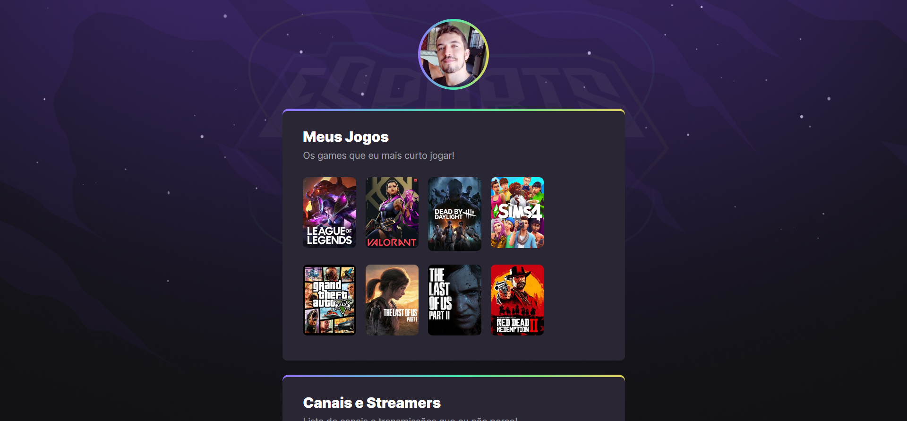

# NLW eSports

>Trilha Explorer

Projeto construído no evento Next Level Week da Rocketseat.

🔗 [Clique aqui para acessar](https://aulette.github.io/nlw/)

## 🛠 Tecnologias

- HTML
- CSS
- Git e Github

## 📖 O que aprendi

Como esse é meu primeiro projeto, aprendi muito na prática não apenas as tecnologias listadas acima, mas também a organizar meu espaço de trabalho, utilizando as ferramentas VSCode e Figma.
Tenho certeza que esse será o primeiro de muitos trabalhos.

## ✉ Contato

aulettemartins@gmail.com
